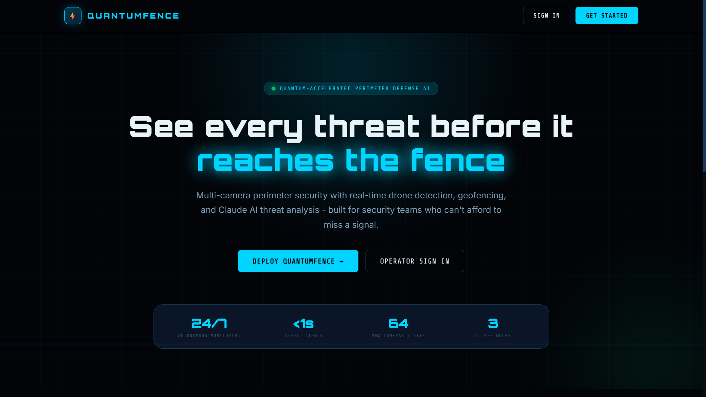

# QuantumFence


## Quantum-Accelerated Perimeter Defense AI System

QuantumFence is an AI-powered multi-camera perimeter security system: a FastAPI backend for cameras, alerts, drones, geofences, and analytics, with a real-time WebSocket event hub, paired with a React web dashboard. Detection is genuinely wired to YOLOv8 (Ultralytics, PyTorch, OpenCV) with an honest mock fallback if those libraries aren't installed, and threat analysis genuinely calls the Claude API.

<div align="center">
  
</div>

## Table of Contents

- [Overview](#overview)
- [Project Structure](#project-structure)
- [Feature Status](#feature-status)
- [Technology Stack](#technology-stack)
- [Architecture](#architecture)
- [Installation and Setup](#installation-and-setup)
- [Running the Stack](#running-the-stack)
- [API Surface](#api-surface)
- [Testing](#testing)
- [CI/CD Pipeline](#cicd-pipeline)
- [Documentation](#documentation)
- [Contributing](#contributing)
- [License](#license)

## Overview

QuantumFence demonstrates a perimeter-security workflow across a real, runnable codebase. The FastAPI backend, YOLOv8 detection pipeline, and Claude-based threat analysis are all genuinely wired, not aspirational. The one gap worth knowing up front: the backend's pytest suite (12 test files) currently runs locally but not in CI, since the entire "Backend Tests" job is commented out in the GitHub Actions workflow.

## Project Structure

```
QuantumFence/
├── code/
│   ├── backend/                # FastAPI application
│   │   ├── api/routes/         # auth, cameras, alerts, drones, geofences, analytics
│   │   ├── api/websocket.py    # Real-time event hub (alerts, detections, camera status)
│   │   ├── services/           # detection_service (OpenCV/YOLOv8), ai_analysis_service
│   │   │                       # (Claude API), and others
│   │   ├── database/           # SQLAlchemy models, including user roles
│   │   └── tests/               # Backend test suite (not currently run in CI)
│   ├── ai_models/                # drone_detector, model_manager (YOLOv8 via
│   │   │                         # Ultralytics/PyTorch, with an honest
│   │   │                         # MockYOLOModel fallback if those packages
│   │   │                         # aren't installed)
│   │   └── tests/                 # ai_models test suite
│   └── integrations/               # Google Maps / Google Earth KML export
├── frontend/                        # React (Vite) web dashboard
├── infrastructure/                    # Docker, Kubernetes, Terraform, Nginx configs
├── scripts/                            # Setup, seeding, deployment, and maintenance scripts
├── docs/                                # Documentation (this directory)
└── README.md
```

## Feature Status

### Application tier (wired and tested)

| Component                   | Details                                                                                                                                                                                                                             |
| :-------------------------- | :---------------------------------------------------------------------------------------------------------------------------------------------------------------------------------------------------------------------------------- |
| **API**                     | FastAPI backend exposing `/api/auth`, `/api/cameras`, `/api/alerts`, `/api/drones`, `/api/geofences`, and `/api/analytics`.                                                                                                         |
| **Auth**                    | JWT sessions with refresh tokens and three roles (Admin, Operator, Viewer), genuinely enforced via a database-backed role model. `SECRET_KEY` falls back to a static placeholder value with no check that rejects it in production. |
| **Detection**               | Real YOLOv8 (Ultralytics, PyTorch, OpenCV) person, vehicle, and drone detection, lazily imported so a missing dependency degrades to an explicitly-named `MockYOLOModel` rather than crashing.                                      |
| **Threat analysis**         | A genuine Anthropic API integration (`services/ai_analysis_service.py`) that calls Claude for natural-language threat summaries and risk scoring, not a placeholder.                                                                |
| **Real-time events**        | A real WebSocket hub (`api/websocket.py`) pushing `alert`, `detection`, `drone_detection`, and `camera_status` events to connected clients.                                                                                         |
| **Geofencing**              | Full CRUD for polygon and circle geofence zones.                                                                                                                                                                                    |
| **Geospatial integrations** | Google Maps and KML export for Google Earth Pro, in `code/integrations`.                                                                                                                                                            |
| **Web dashboard**           | React app (Vite) with React Router, Axios, Leaflet (mapping), and Recharts.                                                                                                                                                         |

### Not currently exercised in CI

| Component              | Details                                                                                                                                                                              |
| :--------------------- | :----------------------------------------------------------------------------------------------------------------------------------------------------------------------------------- |
| **Backend test suite** | The 12-file pytest suite runs locally, but the entire "Backend Tests" job in `.github/workflows/cicd.yml` is commented out, so it doesn't run automatically on push or pull request. |

## Technology Stack

| Area                 | Technology                                                                                   |
| :------------------- | :------------------------------------------------------------------------------------------- |
| Backend API          | Python 3.10+, FastAPI, SQLAlchemy 2.0, Uvicorn                                               |
| AI / computer vision | YOLOv8 (Ultralytics), PyTorch, torchvision, OpenCV (headless)                                |
| Threat analysis      | Claude (Anthropic API)                                                                       |
| Data layer           | PostgreSQL 16 in production, SQLite by default in development; Redis for caching and pub/sub |
| Web frontend         | React 18, Vite, React Router, Axios, Leaflet, Recharts                                       |
| Infrastructure       | Docker, Kubernetes, Terraform, Nginx                                                         |
| Monitoring           | Prometheus, Grafana                                                                          |
| CI/CD                | GitHub Actions                                                                               |
| Testing              | pytest (backend and ai_models, not currently run in CI); the frontend has no test files yet  |

## Architecture

```
Client
  └── frontend (React, Vite)              ── HTTP/WebSocket ──┐
                                                               ▼
Backend (FastAPI)
  ├── Routes    auth, cameras, alerts, drones, geofences, analytics
  ├── WebSocket  real-time hub: alert, detection, drone_detection, camera_status
  ├── Services    detection_service (OpenCV/YOLOv8), ai_analysis_service (Claude)
  └── Data layer    PostgreSQL/SQLite (SQLAlchemy), Redis

AI models (code/ai_models, called by detection_service)
  drone_detector · model_manager (YOLOv8 via Ultralytics/PyTorch,
  mock fallback if those packages aren't installed)

Integrations (code/integrations)
  Google Maps / Google Earth KML export
```

See [docs/TESTING.md](docs/TESTING.md) for the test suite in detail.

## Installation and Setup

Prerequisites: Python 3.10+ and Node.js 18+.

```bash
git clone https://github.com/abrar2030/QuantumFence.git
cd QuantumFence
bash scripts/setup/setup.sh --dev
```

Then configure your API keys in `code/backend/.env`:

```env
ANTHROPIC_API_KEY=sk-ant-your-key-here
GOOGLE_MAPS_API_KEY=your-google-maps-key
```

Seed demo data:

```bash
cd code/backend && source venv/bin/activate
python ../../scripts/setup/migrate_and_seed.py
```

## Running the Stack

```bash
# All-in-one dev startup (from repo root)
bash scripts/deployment/start.sh
```

Or bring up the full containerized stack:

```bash
cd infrastructure/docker
cp .env.example .env      # edit with your API keys
docker-compose up -d
```

| Service      | Image                     | Port(s)      | Purpose                    |
| :----------- | :------------------------ | :----------- | :------------------------- |
| `backend`    | built from `code/backend` | 8000         | REST API and WebSocket hub |
| `frontend`   | built from `frontend`     | 80, 443      | Serves the web dashboard   |
| `db`         | `postgres:16-alpine`      | 5432         | Primary database           |
| `redis`      | `redis:7-alpine`          | 6379         | Cache and pub/sub          |
| `prometheus` | `prom/prometheus:v2.53.0` | 9090         | Metrics collection         |
| `grafana`    | `grafana/grafana:11.1.0`  | 3001 -> 3000 | Metrics dashboards         |

**Access points:** Frontend at `http://localhost:3000`, API docs at `http://localhost:8000/api/docs`. A seeded default login (`admin` / `quantumfence`) is created by `migrate_and_seed.py`. New self-service signups always land as an operator; only an admin can grant other roles from Settings → Users.

## API Surface

Base URL `http://localhost:8000/api`. Interactive docs at `/api/docs`.

| Group     | Prefix                    | Highlights                                                                          |
| :-------- | :------------------------ | :---------------------------------------------------------------------------------- |
| Auth      | `/api/auth`               | `register`, `login`, `me`, `change-password`, `users` (admin), `users/{id}` (admin) |
| Cameras   | `/api/cameras`            | list/create                                                                         |
| Alerts    | `/api/alerts`             | list with filters, `{id}/acknowledge`                                               |
| Drones    | `/api/drones`             | Drone detection log                                                                 |
| Geofences | `/api/geofences`          | list/create, `{id}` (update, delete)                                                |
| Analytics | `/api/analytics/overview` | System overview stats                                                               |
| WebSocket | `/ws/{client_id}`         | Real-time event stream (`alert`, `detection`, `drone_detection`, `camera_status`)   |

Full Swagger documentation is at `http://localhost:8000/api/docs` once the backend is running.

## Testing

```bash
# Backend (from code/backend)
pytest

# AI models (from code/ai_models)
pytest

# Everything, via the project script
bash scripts/run_tests.sh
```

The backend suite has 12 test files; `ai_models` has 3. The frontend has no test files yet. See [docs/TESTING.md](docs/TESTING.md) for what each suite covers.

## CI/CD Pipeline

GitHub Actions (`.github/workflows/cicd.yml`) currently runs two active jobs on push, pull request, and manual dispatch:

| Job                 | Status                                                                                                                                         |
| :------------------ | :--------------------------------------------------------------------------------------------------------------------------------------------- |
| Code Quality Checks | Active. Formatter checks across the repository (including Solidity-aware Prettier config, though there are no Solidity files in this project). |
| Backend Tests       | Commented out in the workflow file. Defined but does not run; the 12-file pytest suite is not exercised in CI.                                 |
| Build (frontend)    | Active. Installs dependencies and produces the production web build (no test step, and the frontend has no tests to run yet regardless).       |

## Documentation

| Document                           | Contents                                  |
| :--------------------------------- | :---------------------------------------- |
| [docs/TESTING.md](docs/TESTING.md) | Test suite structure and coverage details |
| [docs/images/](docs/images/)       | Screenshots                               |

## Contributing

Open a pull request.

## License

This project is licensed under the MIT License - see the [LICENSE](LICENSE) file for details.
